# Harvest lifecycle

This note is the shortest route to understanding what actually happens during a harvest run.
Use `docs/operations.md` for deployment knobs and operator commands; use this file for process responsibilities, job flow, and the safety rules around ownership and recovery.

## Runtime roles

| Component | Responsibility | Primary evidence |
|---|---|---|
| `nordicintel-bootstrap` | Temporary operator control plane before the API exists. It upserts providers, manages schedules, enqueues or cancels jobs, and inspects jobs and harvested tables. It stores no separate state of its own. | `README.md`, `src/nordicintel_harvest/bootstrap.py` |
| `nordicintel-scheduler` | Singleton background process. On each tick it recovers stale jobs, then enqueues due schedules. | `README.md`, `docs/operations.md`, `src/nordicintel_harvest/scheduler.py` |
| `nordicintel-worker` | Long-running executor. It claims one job, prepares the adapter and HTTP client, runs the harvest, finalizes the terminal status, and releases the provider. | `README.md`, `src/nordicintel_harvest/worker.py` |
| `HarvestEngine` | Per-job traversal logic: validate the requested language, resolve scope, discover tables, decide fetch vs skip, persist accepted metadata, and record per-item outcomes. | `src/nordicintel_harvest/engine.py` |
| `JobControl` | Heartbeat, cooperative stop observation, and ownership-loss handling while a job is running. | `src/nordicintel_harvest/control.py` |

A useful rule of thumb: bootstrap admits work, the scheduler decides when work should exist, and the worker is the only process that executes the work.

## Why discovery is language-scoped

A harvest job is **one provider in one language**.
That is not a convenience flag; it is how the runtime avoids inventing facts that only the upstream catalogue can know.

For PxWeb-style publishers, the catalogue itself is language-specific. A table that exists in Swedish but not English is absent from the English listing rather than present with an empty payload. By discovering in the job's own language, the runtime asks a concrete question — *what exists in this language right now?* — instead of discovering once and then guessing per table which languages should exist.

That design keeps three things simple and durable:

- each language has its own schedule and queue entry
- each run owns one language inventory from start to finish
- a missing language variant is represented as "not discovered in that catalogue", not as a synthetic failure state

See `README.md`, `docs/operations.md`, `src/nordicintel_harvest/engine.py`, and `tests/engine/test_incremental.py`.

## What happens during a run

1. **A job is admitted**
   - An operator may enqueue it manually through `nordicintel-bootstrap`.
   - Or `nordicintel-scheduler` may enqueue it when a schedule becomes due.
   - Schedules are already language-specific, so Swedish and English runs are distinct jobs.
   - If a provider is already busy, the scheduler advances the due schedule instead of stacking duplicate queued runs.

2. **The worker claims ownership**
   - `nordicintel-worker` opens an owner session, claims at most one queued job, and holds the provider lock for that attempt.
   - If no job is available, it sleeps for `queue_poll_seconds` and tries again.

3. **The worker prepares the job-scoped dependencies**
   - It loads the provider definition.
   - It resolves the configured adapter type through the registry.
   - It resolves `secret_refs` from the environment.
   - It creates one shared HTTP client for the attempt and asks the adapter factory for a job-scoped adapter instance.

4. **Heartbeat and stop observation start immediately**
   - `JobControl` begins calling `HarvestRepository.heartbeat(...)` on a timer.
   - That single call both refreshes liveness and reports whether a stop was requested.
   - If the process is shutting down, the worker records cancellation intent before abandoning in-flight work, so recovery can distinguish an intentional stop from a vanished owner.

5. **The engine validates the language and resolves scope**
   - `HarvestEngine` asks the adapter which languages the provider publishes.
   - An unsupported language fails the whole job once, before any table work begins.
   - For a single-table request, the engine resolves the canonical `table_id` to the stored upstream `native_table_id` before calling the adapter.

6. **Discovery defines the inventory for this run**
   - The engine calls `adapter.discover(...)` for the requested scope.
   - For provider-wide runs, the returned entries are the tables this provider currently publishes in the job's language.
   - For single-table runs, the engine requires discovery to contain exactly that one upstream table.

7. **Each discovered table becomes one harvest item**
   - The engine opens an item record.
   - It decides whether to fetch or skip.
   - A fetch is forced when the request says `force=true`, when the language has never been accepted before, or when the previous attempt for that language failed.
   - Otherwise the adapter's refresh decision decides whether the table is still current.

8. **Fetched results are validated and persisted**
   - The adapter returns one metadata result for the current provider, table, and language.
   - The engine validates that identity triple before persisting it.
   - Accepted results are written through core repositories; the worker does not write table metadata itself.

9. **The job finalizes to one terminal status**
   - `completed` when traversal finished
   - `failed` when the job could not be carried out end to end
   - `cancelled` when a stop was requested and observed
   - The worker then releases the provider lock.

## Job and item states

```mermaid
stateDiagram-v2
    [*] --> queued
    queued --> running: worker claims job
    running --> completed: traversal finishes
    running --> failed: discovery/config/defect
    running --> cancelled: stop observed
    running --> failed: owner disappears; scheduler recovers as worker_abandoned
```

### Job outcomes

| Job status | Meaning |
|---|---|
| `completed` | The run traversed its scope. Individual tables may still have failed. |
| `failed` | The job as a whole could not be carried out, or recovery closed an abandoned run. |
| `cancelled` | A stop was requested and observed cooperatively. Already accepted work is kept. |

### Item outcomes

| Item status | Meaning |
|---|---|
| `updated` | Metadata for that table/language was fetched and accepted. |
| `skipped` | The table was checked and already current. |
| `failed` | That one table failed, but the rest of the job may continue. |

Two important edges are easy to miss:

- there is **no automatic resume** of an abandoned running job; recovery closes it and the next scheduled or manual run creates new work
- a missing table in a later discovery pass does **not** delete or tombstone stored metadata; absence is currently passive

See `docs/operations.md`, `tests/integration/test_worker.py`, and `tests/engine/test_incremental.py`.

## Ownership, heartbeat, cancellation, and stale recovery

The runtime's safety model depends on **database session ownership**, not just Python control flow.

- Ownership is tied to one physical PostgreSQL backend plus session-scoped advisory locks.
- That is why `nordicintel-worker` and `nordicintel-scheduler` use owner sessions, while `nordicintel-bootstrap` can use the pooled API engine for short administrative calls.
- The worker does not reconnect mid-attempt. If the owner session is lost, it must stop writing immediately.
- `heartbeat_seconds` and `stale_after_seconds` are coupled on purpose: a healthy worker must have time to emit several heartbeats before recovery is allowed to treat it as dead.
- If the owner disappears without finalizing, `nordicintel-scheduler` later marks the job as failed with `worker_abandoned` and closes any open item state.
- A second scheduler is not redundancy; it fails because the first one holds the singleton advisory lock.

This is also why `docs/operations.md` warns against transaction-pooling database endpoints: the runtime needs a stable backend identity for both ownership and stale-job recovery.

## Where the adapter boundary sits

The adapter boundary is intentionally narrow.

The worker owns:

- queue claim and finalization
- provider locking and ownership rules
- heartbeat and cancellation handling
- secret resolution
- shared HTTP client construction, including request spacing

The adapter owns:

- supported-language reporting
- upstream discovery
- upstream-specific refresh marker semantics
- metadata fetch and normalization
- live data fetch semantics

In other words, the worker decides **when** a run exists and **whether** it may keep speaking for it; the adapter decides **how** to talk to the upstream service for that provider family.

That boundary is described in `src/nordicintel_harvest/worker.py`, `src/nordicintel_harvest/engine.py`, `README.md`, and the adapter repo's `README.md` plus `docs/onboarding/adapter-contract.md`.

## Executable specs worth reading before changing behavior

If you need the runtime contract in its least ambiguous form, start with these tests:

- `tests/integration/test_worker.py` — claim/finalize flow, provider serialization, cooperative cancellation, singleton scheduler behavior, and stale-job recovery
- `tests/engine/test_incremental.py` — per-language discovery, skip vs update decisions, forced refresh, interrupted-item behavior, and missing-table semantics

Those tests are effectively the prose doc with sharper edges.

## Next reads

- `docs/operations.md` — deployment settings, first-run commands, shutdown, and failure diagnosis
- `docs/onboarding/harvest-runtime.md` — longer source-backed orientation with more implementation detail
- `src/nordicintel_harvest/worker.py` and `src/nordicintel_harvest/engine.py` — the two code entry points that define the runtime contract most directly
